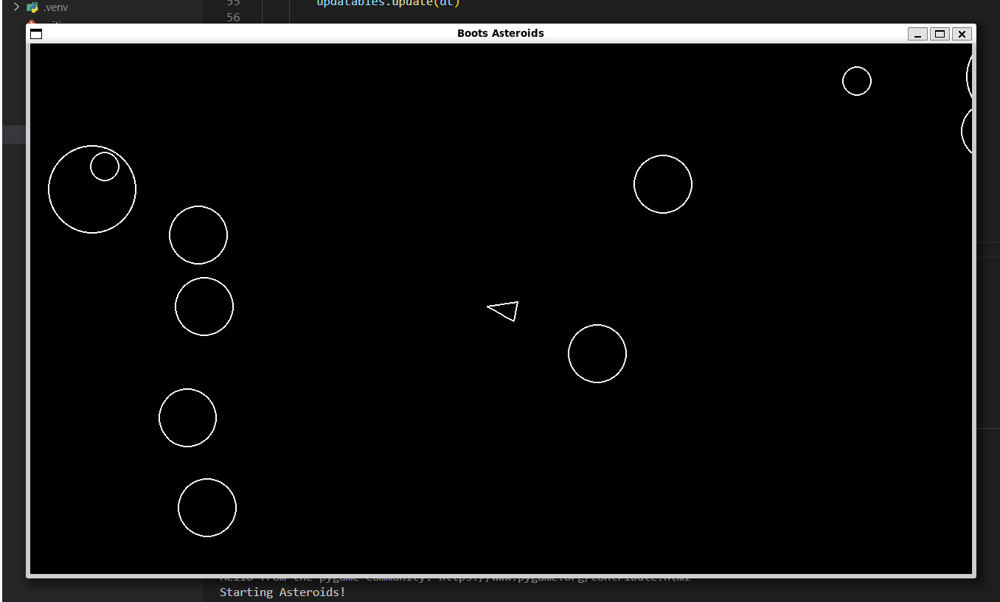

# 🪐 Boots Asteroids

A Python + Pygame clone of the classic *Asteroids* game, built step-by-step with a focus on game loop design, object-oriented architecture, and group-based sprite management.

---

## 🚀 Gameplay Overview

- Control a spaceship and survive an onslaught of asteroids.
- Shoot incoming asteroids — large ones split into smaller, faster ones.
- Game ends on collision with any asteroid.

---

## 🎮 Controls

| Key        | Action                  |
|------------|--------------------------|
| `A`        | Rotate Left              |
| `D`        | Rotate Right             |
| `W`        | Thrust Forward           |
| `S`        | Thrust Backward          |
| `Spacebar` | Fire Bullet              |
| `X`        | Quit (or close window)   |

---

## 📦 Requirements

- Python 3.10+
- [Pygame 2.6.1](https://www.pygame.org/news)
- `uv` package manager

---

## 🛠️ Setup Instructions

### 1. Clone the Repository

```bash
git clone https://github.com/YOUR-USERNAME/boots_asteroids.git
cd boots_asteroids
```

### 2. Set Up the Environment

```bash
uv venv
source .venv/bin/activate
uv add pygame==2.6.1
```
-----> Make sure the virtual environment is activated when running the game!

### 3. Run the Game
```bash
uv run main.py
```

## 🧩 Project Structure

boots_asteroids/

│

├── main.py                # Main game loop

├── constants.py           # All global constants

├── player.py              # Player spaceship logic

├── asteroid.py            # Asteroid object + split logic

├── asteroidfield.py       # Asteroid spawner

├── shot.py                # Bullet logic

├── circleshape.py         # Base class with collision detection

├── screenshot.png         # screenshot of game play 

├── README.md              # You're here!


## ⚙️ Features Implemented

✅ Game loop with input, update, and draw steps

✅ Pygame sprite Groups for clean object management

✅ Collision detection between player, bullets, and asteroids

✅ Asteroid splitting logic with randomized velocities

✅ Bullet rate limiting with cooldown timer

✅ Object-oriented structure using inheritance (CircleShape)

✅ Delta-time movement for consistent gameplay speed


## 📚 What I Learned

📌Project structure with multiple files: Organizing code into modules (player.py, asteroid.py, etc.) improves readability and maintainability.

📌Using classes and inheritance: Created a CircleShape base class to share common behaviors like collision detection.

📌Managing game objects with Pygame Groups: Simplified updating and drawing by grouping sprites, keeping the game loop clean.

📌Handling user input and delta time: Used Pygame’s input system and delta time (dt) to ensure smooth, consistent movement regardless of frame rate.

📌Implementing game mechanics: Developed shooting, asteroid splitting, and collision detection step-by-step.

📌Working with virtual environments and dependencies: Used uv to manage a Python virtual environment and install Pygame without conflicts.

📌Version control with Git and GitHub: Learned to commit often, manage branches, and resolve merge conflicts.

## 🧪 Future Ideas

🛠️Add sound effects

🛠️Track score and high scores

🛠️Add lives and power-ups

🛠️Implement screen wraparound

🛠️Add a main menu and restart option

## 📸 Screenshot
<p align="center">
  
</p>
